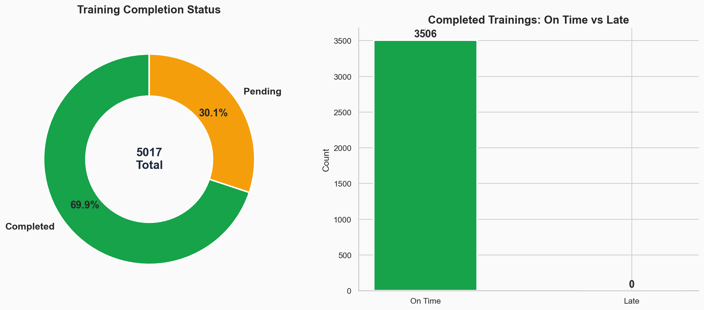
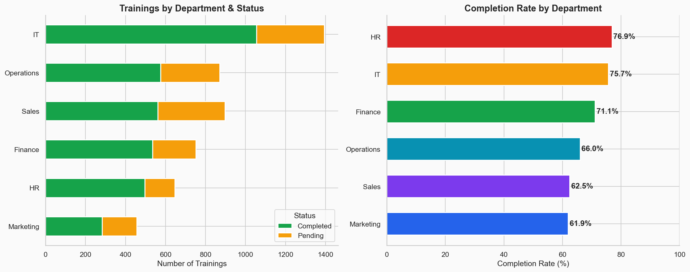
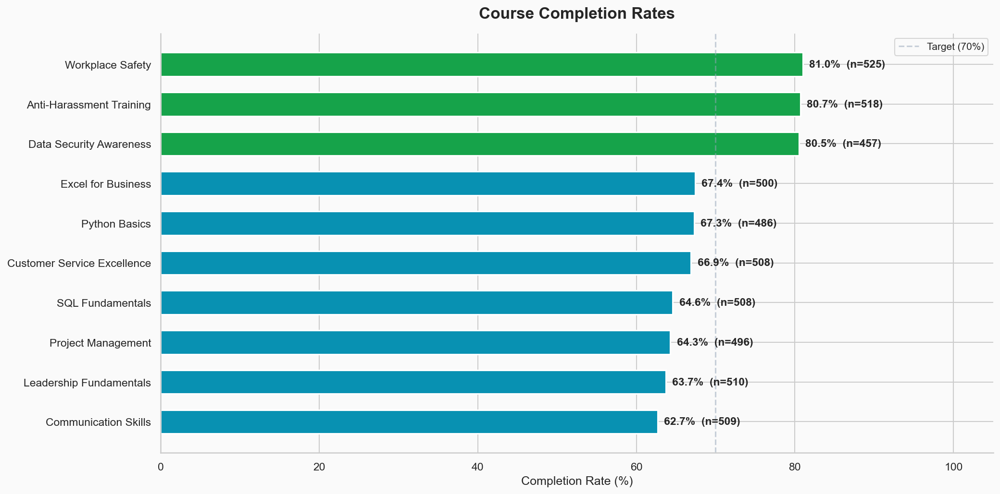
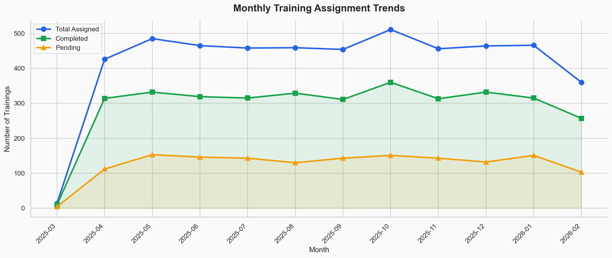
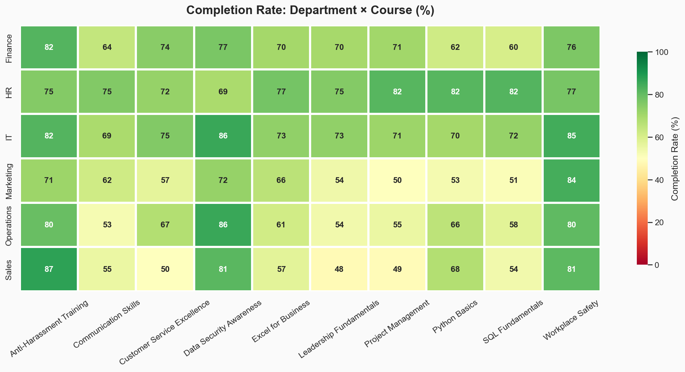
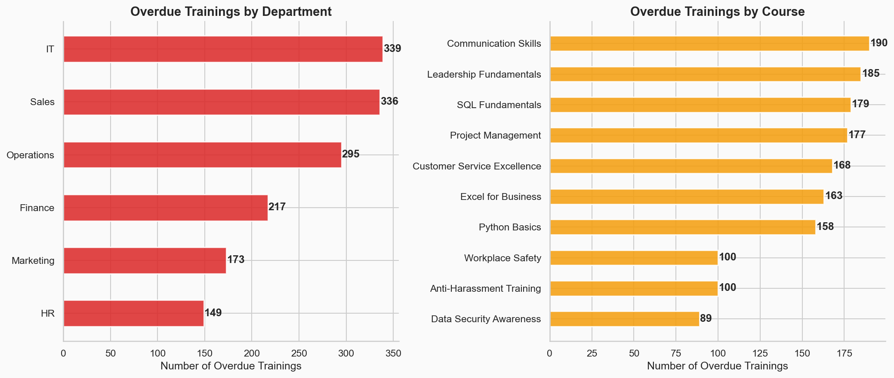

# 📊 Data Management & Reporting Dashboard

> **An end-to-end data analytics project** that simulates an LMS (Learning Management System) training dataset, cleans and transforms the data using Python, generates business insights, and presents them through professional visualizations and Excel-based reporting.

---

## 🎯 Project Objective

Organizations need to track employee training compliance to ensure workforce readiness. This project builds a **complete data pipeline** to:

- Generate and manage a realistic LMS training dataset (5,000+ records)
- Clean and standardize raw data with quality issues
- Calculate key performance metrics (KPIs) across departments and courses
- Identify overdue trainings and at-risk employees
- Visualize findings through charts and Excel dashboards
- Export structured reports for stakeholder use

---

## 📈 Key Performance Indicators (KPIs)

| KPI | Value |
|-----|-------|
| Total Training Records | 5,017 |
| Unique Employees | 350 |
| Training Courses | 10 |
| **Completion Rate** | **69.9%** |
| Pending Trainings | 1,511 |
| **Overdue Trainings** | **1,509 (30.1%)** |
| Avg Completion Time | 7.1 days |
| Total Departments | 6 |

---

## 🔍 Key Insights

1. **Overall completion rate is 69.9%** — below the 80% industry benchmark, indicating room for improvement
2. **HR department leads** with 76.9% completion rate, followed by IT at 75.7%
3. **Marketing department needs attention** with only 61.9% completion — lowest among all departments
4. **Mandatory courses** (Data Security, Workplace Safety, Anti-Harassment) achieve ~80%+ completion, while elective courses average ~64%
5. **'Communication Skills'** has the lowest completion rate (62.7%) — content or engagement may need review
6. **30.1% of all pending trainings are overdue** — immediate intervention required
7. **Sales and Operations** departments show consistently lower completion across elective courses

---

## 🛠️ Tools & Technologies Used

| Tool | Purpose |
|------|---------|
| **Python 3** | Core programming language |
| **Pandas** | Data cleaning, transformation, and analysis |
| **NumPy** | Numerical operations and random data generation |
| **Matplotlib** | Chart creation and visualization |
| **Seaborn** | Statistical visualizations (heatmap, boxplot) |
| **openpyxl** | Excel reports with VLOOKUP, COUNTIFS, IF formulas, filters |
| **Excel Formulas** | VLOOKUP, COUNTIFS, AVERAGEIFS, nested IF, SUMPRODUCT |

---

## 📦 Project Structure

```
Data Management & Reporting Dashboard/
│
├── data/
│   ├── lms_raw.csv              # Raw dataset with quality issues
│   └── lms_cleaned.csv          # Cleaned & transformed dataset
│
├── notebooks/
│   ├── data_cleaning.ipynb      # Step-by-step cleaning walkthrough
│   └── analysis.ipynb           # Analysis with inline visualizations
│
├── scripts/
│   ├── generate_data.py         # Synthetic dataset generator
│   ├── clean_data.py            # Data cleaning pipeline
│   ├── analyze_data.py          # Analysis & Excel report generator
│   ├── create_visuals.py        # Chart/visualization generator
│   └── create_excel_dashboard.py # Excel dashboard (VLOOKUP, pivots, filters)
│
├── reports/
│   ├── summary_report.xlsx      # Multi-sheet Excel analysis report
│   └── dashboard.xlsx           # Excel dashboard with formulas & charts
│
├── visuals/
│   ├── completion_overview.png  # Donut chart + on-time vs late
│   ├── department_performance.png
│   ├── course_analysis.png
│   ├── monthly_trends.png
│   ├── overdue_analysis.png
│   ├── completion_time.png      # Histogram + boxplot
│   └── heatmap_dept_course.png  # Dept × Course completion heatmap
│
├── run_pipeline.py              # One-click automation script
├── requirements.txt             # Python dependencies
├── .gitignore
└── README.md
```

---

## 🚀 How to Run

### Prerequisites
```bash
pip install -r requirements.txt
```

### Option 1: Run Full Pipeline (Recommended)
```bash
python3 run_pipeline.py
```
This runs all 5 steps automatically:
1. Generate synthetic dataset → `data/lms_raw.csv`
2. Clean & transform data → `data/lms_cleaned.csv`
3. Analyze & create report → `reports/summary_report.xlsx`
4. Generate 7 visualizations → `visuals/*.png`
5. Build Excel dashboard → `reports/dashboard.xlsx`

### Option 2: Run Steps Individually
```bash
python3 scripts/generate_data.py
python3 scripts/clean_data.py
python3 scripts/analyze_data.py
python3 scripts/create_visuals.py
python3 scripts/create_excel_dashboard.py
```

### View the Reports
```bash
open reports/dashboard.xlsx    # Open Excel dashboard
```

---

## 📊 Sample Visualizations

### Completion Overview


### Department Performance


### Course Completion Rates


### Monthly Trends


### Department × Course Heatmap


### Overdue Analysis


---

## 📋 Data Pipeline Details

### Phase 1: Data Generation
- Created 350 unique employees across 6 departments (IT, HR, Sales, Finance, Operations, Marketing)
- Generated 5,000+ training records spanning 10 courses over 12 months
- Introduced realistic data quality issues: duplicates (~2%), missing values (~1.5%), text inconsistencies (~3%), mixed date formats (~2%)

### Phase 2: Data Cleaning
| Issue | Count | Resolution |
|-------|-------|------------|
| Duplicate rows | 83 | Removed with `drop_duplicates()` |
| Inconsistent status | 8 variants | Mapped to 2 standard values (Completed/Pending) |
| Department typos | 4 variants | Standardized (e.g., "I.T." → "IT") |
| Missing departments | 75 | Filled with mode |
| Mixed date formats | ~100 | Parsed with `pd.to_datetime(format='mixed')` |

### Phase 3: Derived Columns Added
- `completion_time_days` — Days taken to complete training
- `is_overdue` — Flag for pending trainings past due date
- `assigned_month` — Month-year for trend analysis
- `days_allowed` — Buffer between assignment and due date
- `completed_on_time` — Flag for timely completion

### Phase 4: Analysis & Reporting
- Department-wise completion rates and rankings
- Course-wise performance comparison
- Monthly trend analysis (12 months)
- Overdue employee identification (362 employees affected)
- Cross-tabulation heatmap (Department × Course)
- Exported to 7-sheet Excel workbook

---

## 📝 Excel Reports

### `summary_report.xlsx` — Analysis Report
| Sheet | Contents |
|-------|----------|
| KPIs | 10 key performance indicators |
| Department Analysis | Completion rates, overdue counts by department |
| Course Analysis | Performance metrics for each course |
| Monthly Trends | Assignment and completion trends over 12 months |
| Overdue Employees | List of employees with overdue trainings |
| Dept-Course Matrix | Cross-tabulation of completion rates |
| Key Insights | 8 auto-generated business insights |

### `dashboard.xlsx` — Excel Dashboard (VLOOKUP, Pivots, Filters)
| Sheet | Excel Features Used |
|-------|--------------------|
| KPI Dashboard | COUNTIF, SUMPRODUCT, formula-driven KPI cards |
| Training Data | **Auto-filters**, conditional formatting, data bars, color scales |
| Employee Lookup | **VLOOKUP**, COUNTIFS, FORMULATEXT — enter any Employee ID to look up details |
| Pivot - Departments | **COUNTIFS, AVERAGEIFS** pivot table + bar chart |
| Pivot - Courses | COUNTIFS, nested **IF** status flags + horizontal bar chart |
| Overdue Tracker | Nested **IF** priority levels, auto-filters, data bars |
| Monthly Trends | IF formulas, color scales, line chart |

---

## 💡 What This Project Demonstrates

- **Data Wrangling:** Handling real-world data quality issues (duplicates, missing values, inconsistent formats)
- **Pandas Proficiency:** GroupBy, pivot tables, aggregation, datetime operations
- **Excel Skills:** VLOOKUP, COUNTIFS, AVERAGEIFS, nested IF, auto-filters, conditional formatting, pivot tables
- **Statistical Thinking:** Deriving KPIs, identifying trends, spotting anomalies
- **Data Visualization:** Creating professional, publication-ready charts
- **Report Generation:** Automated Excel reports with formulas, charts, and multiple sheets
- **Pipeline Automation:** Single-command execution of the entire workflow
- **Documentation:** Clear, professional README with insights and methodology

---

## 👤 Author

**Manikanta**

---
